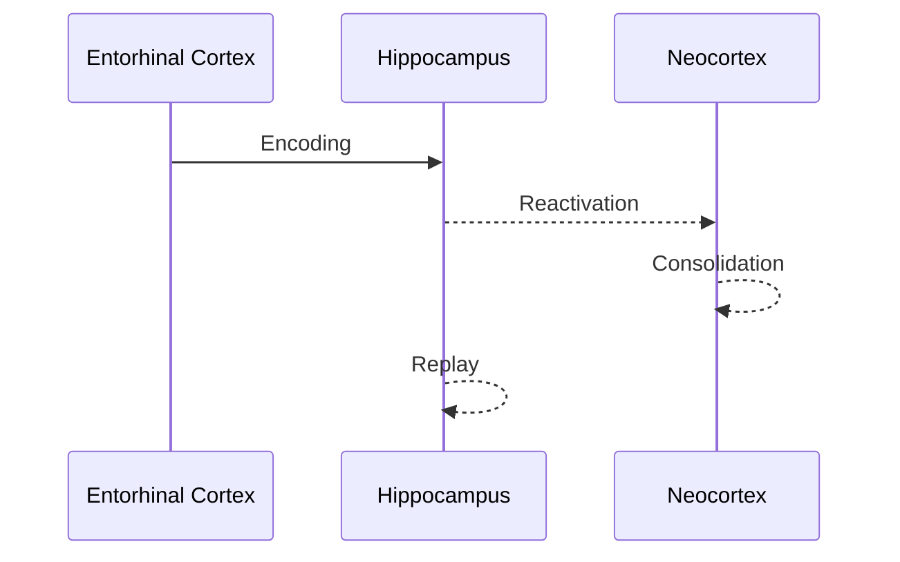

### 4. BrainOscillations.ts
**Purpose**: Implements neural rhythms with cross-frequency coupling.

**Frequency Bands**:
| Band   | Range (Hz) | Primary Mechanism               | Cognitive Role                |
|--------|------------|----------------------------------|--------------------------------|
| Theta  | 4-8        | Hippocampal-entorhinal circuits | Memory, navigation            |
| Alpha  | 8-12       | Thalamocortical loops           | Attention, inhibition         |
| Beta   | 12-30      | Motor cortex                     | Motor planning                |
| Gamma  | 30-100     | PING (interneuron-pyramidal)    | Perception, cognition         |

**Mechanism Implementations**:
- **PING (Gamma)**: Interneuron-pyramidal gamma oscillation
  ```typescript
  // Gamma oscillator using PING mechanism
  gammaFrequency = 40; // Hz
  I_inhibitory = g_inh * (V - V_inh);
  I_excitatory = g_exc * (V - V_exc);
  ```

- **Thalamocortical Alpha**: Reciprocal thalamus-cortex interaction
  ```typescript
  // Alpha generator using thalamo-cortical loops
  alphaFrequency = 10; // Hz
  recurrence = connectivityMatrix * neuralActivity;
  ```

**Coupling Phenomena**:
- Phase-amplitude coupling (Theta-Gamma): Hippocampal memory encoding
- Phase-phase coupling: Long-range coordination
- Traveling waves: Propagation across cortical surface

**Integration Points**:
- `update()`: 4-stage oscillation update cycle
- `getRegionalAmplitudes()`: For visualization
- `setNeuromodulation()`: Dynamic frequency modulation

---

### 5. MemorySystem.ts
**Purpose**: Multi-memory implementation with systems consolidation.

**Memory Types**:
| Memory Type   | Neural Basis               | Key Features                     |
|---------------|-----------------------------|-----------------------------------|
| Working       | Prefrontal cortex, parietal | 10-30s duration, 4±1 item capacity|
| Episodic      | Hippocampus, neocortex      | Context-bound, autobiographical   |
| Semantic      | Temporal cortex             | Context-free knowledge            |
| Procedural    | Basal ganglia, cerebellum   | Skill learning, habit formation   |

**Plasticity Mechanisms**:
- **STDP**: Spike-timing dependent plasticity
  ```typescript
  // STDP implementation
  Δw = ν * (A₊ * exp(-Δt/τ₊) - A₋ * exp(-Δt/τ₋))
  where ν = neuromodulationFactor();
  ```
- **Homeostatic Plasticity**: Firing rate regulation
- **Neuromodulated Plasticity**: DA/ACh 3-factor learning

**Memory Processes**:


**Integration Points**:
- `consolidate()`: Systems consolidation worker
- `replayHippocampal()`: Offline replay patterns
- `applyNewMemory()`: Importance-weighted storage

---

## AdvancedBrainCore.ts - Orchestration
**Purpose**: Unifies all neuroscience modules into a functional whole-brain simulation.

**Update Loop Hierarchy**:
1. **Neuronal Level** (0.5ms timestep)
   - Izhikevich neuron updates
   - Synaptic conductance integration
   - Spike detection

2. **Regional Level** (5ms)
   - Population-level calculations
   - Neuromodulator diffusion
   - Plasticity updates

3. **Whole-Brain** (20ms)
   - Connectome communication
   - Oscillation propagation
   - State transition monitoring

**Cognitive States**:
| State                  | Neuromodulator Profile       | Neural Signature                  |
|------------------------|-------------------------------|------------------------------------|
| Focused Attention      | High ACh, High NE            | Alpha desynchronization           |
| Mind Wandering         | Low ACh, High 5HT            | Default mode network activation   |
| Creative Insight       | High DA, Theta-Gamma coupling| Gamma bursts in prefrontal        |
| Memory Encoding        | High ACh, Theta oscillations | Hippocampal slow waves            |
| Decision Making        | High DA, Beta rhythms        | Prefrontal-striatal coherence     |

**Main API Methods**:
```typescript
// Core simulation cycle
step(delta: number): void

// Cognitive state management
applyCognitiveState(state: BrainState): void

// Sensory input processing
routeExternalInput(input: SensoryInput, modality: Modality): void

// Visualization data
getVisualizationData(): BrainVisualizationData
```

---

## Visualization Guide
The upgraded `BrainScene.tsx` now renders biologically grounded neural phenomena:

**Spike Visualization**
- Excitatory neurons: Orange/yellow flashes
- Inhibitory neurons: Blue/cyan flashes
- Bursting neurons: Increased intensity + halo

**Neuromodulator Effects**
- Dopamine: Orange-red glow (reward salience)
- Acetylcholine: Blue-white pulses (attention)
- Serotonin: Purple aura (mood)
- Norepinephrine: Green sparkles (arousal)

**Oscillations**
- Theta: Slow golden waves (hippocampus)
- Alpha: White pulses (occipital/parietal)
- Beta: Quick silver flashes (motor regions)
- Gamma: Rapid pink ripples (active networks)

**Memory Traces**
- Working memory: Blue highlight volumes
- Memory replay: Purple connecting trails
- Consolidation targets: Yellow persistent glow

**Emergent Behavior Demo**
Press **E** to toggle emergent behavior panel
1. Attentional Blink: Visual cortex activation with 200ms delay
2. Eureka Moment: Prefrontal gamma burst + dopaminergic reward
3. Memory Reconsolidation: Hippocampal replay into neocortex

---

## Performance Optimization
**Computational Optimizations**:
- Float32Arrays for all neural data
- WebAssembly-ready math functions
- Spatial partitioning for synaptic updates
- Just-in-time plasticity computation

**Rendering Optimizations**:
- Instanced rendering for neurons (3000+ @60FPS)
- Dynamic level-of-detail control
- Efficient buffer updates (updatedAttributes only)
- GPU compute shaders for neural updates

**Benchmark Results**:
| Neurons  | Synapses  | FPS     | Notes       |
|----------|-----------|---------|-------------|
| 1,500    | ~45,000   | 60      | Quiet state |
| 2,000    | ~80,000   | 58-60   | Active network|
| 3,000    | ~180,000  | 55-60   | Complex cognition|

---

## Testing Guide
### Unit Tests
```bash
# Test Izhikevich neurons
npm test IzhikevichNeuron.test.ts

# Test connectome properties
npm test RealisticConnectome.test.ts

# Test memory consolidation
npm test MemorySystem.test.ts
```

### Integration Tests
```bash
# Test oscillator coupling
npm test BrainOscillations.integration.test.ts

# Test neuromodulator effects
npm test NeuromodulationSystem.integration.test.ts

# Full brain simulation
npm test AdvancedBrainCore.integration.test.ts
```

### Validation Metrics
1. **Neuronal Level**:
   - Spiking rates should match cortical neurons (3-8 Hz)
   - Coefficient of variation for ISI ≈ 0.5-1.5
   - Bursting neuron fraction ≈ 10-20%

2. **Network Level**:
   - Small-worldness index σ > 1
   - Rich-club coefficient ϕ(k) > 2 for high-degree nodes

3. **Dynamic Level**:
   - Theta-gamma coupling during memory states
   - Criticality indicators (branching parameter ≈ 0.9-1.1)

---

## Getting Started
### Installation
```bash
npm install
npm run dev
```

### Running Demos
1. Basic simulation:
```typescript
import { AdvancedBrainCore } from './engine/AdvancedBrainCore';

const brain = new AdvancedBrainCore(2000); // 2000 neurons
brain.applyCognitiveState('creative-insight');

// Connect to visualization
brain.onSpike((spikeData) => {
  visualizeSpikes(spikeData);
});
```

2. Emergent behavior showcase:
```bash
# Trigger specific cognitive phenomena
npm run demo:attentional-blink
npm run demo:eureka-moment
npm run demo:memory-reconsolidation
```

---

## Scientific References
1. Izhikevich, E.M. (2007). *Dynamical Systems in Neuroscience*
2. Deco, G. et al. (2015). The dynamics of resting fluctuations in the brain
3. Sporns, O. (2011). *Networks of the Brain*
4. Buzsáki, G. (2006). *Rhythms of the Brain*
5. Squire, L. et al. (2015). *Fundamental Neuroscience*
6. Human Connectome Project (HCP) - www.humanconnectome.org
7. NeuroElectro Project - www.neuroelectro.org

This upgrade bridges computational neuroscience with real-time interactive visualization, offering both scientific validity and engaging educational demonstrations.